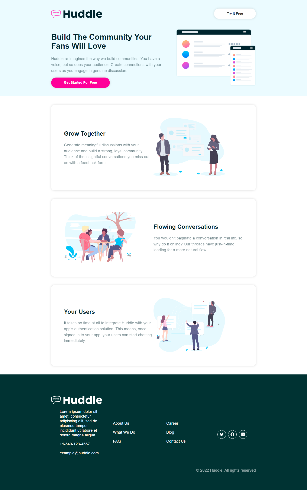

# React + Styled Component Example

## React Styling
1. Inline CSS
2. External CSS
3. CSS Module
4. Styled Component

[Styled Components >](https://styled-components.com/)

Styled Component paketi bileşenlerinizi ES6 standartlarında CSS ile şekillendirmenizi sağlar. Bileşen bazında biçimlendirme yapıldığı için bileşen dahil edildiği sürece CSS dahil edilir. Böylece gereksiz kodlar yüklenmemiş olur. Ayrıca inline yazılan CSS karmaşasından da kurtulmuş oluyoruz.

```npm
npm install
npm start
```
NOT : Bu uygulama [Traversy Media](https://www.youtube.com/watch?v=02zO0hZmwnw) kanalı takip edilerek oluşturuldu.

